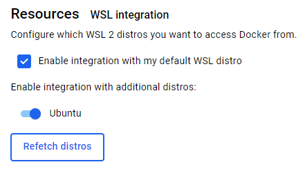
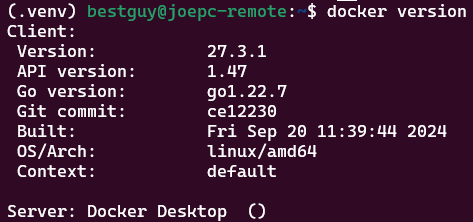
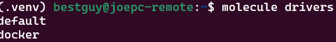

In WSL:

- Make sure you are able to run docker in WSL:


```sh
docker ps
```


- If not, install docker desktop and go to “Settings > Resources > WSL integration” and make sure that ‘Ubuntu’ and integration are checked:



- Make sure that our user is able to run docker without sudo:


```sh
sudo usermod -aG docker $USER
```


- Now you should be able to run ‘docker version’ without any permission errors:



- Install required packages:


```sh
sudo apt update && sudo apt install -y python3-pip python3-venv python3-docker
```


- Create and activate a python virtual environment:


```sh
python3 -m venv .venv && source .venv/bin/activate
```


In the virtual environment:

- Install required python packages:


```sh
pip install molecule molecule-docker yamllint ansible-lint
```


- Test docker installation and docker driver presence:


```sh
docker ps
```

```sh
molecule drivers
```


With this, you should have docker and molecule working correctly in your virtual environment, follow steps here to add molecule functionality to a collection.